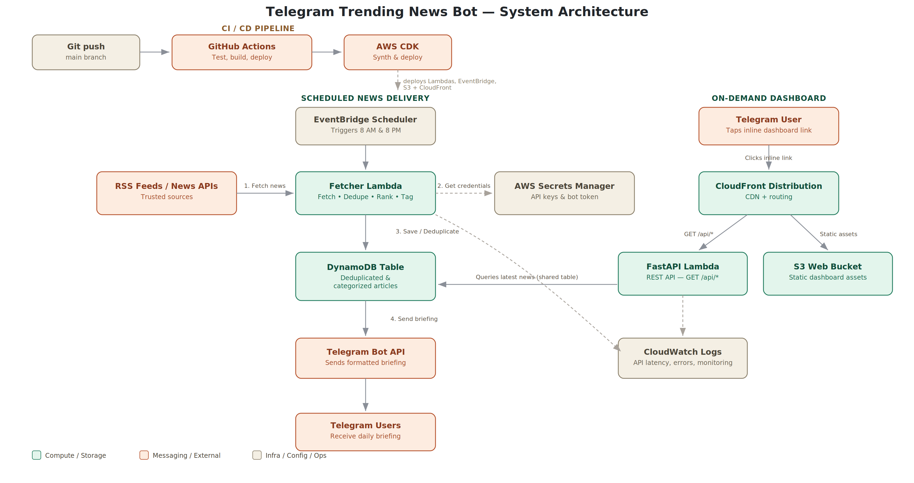
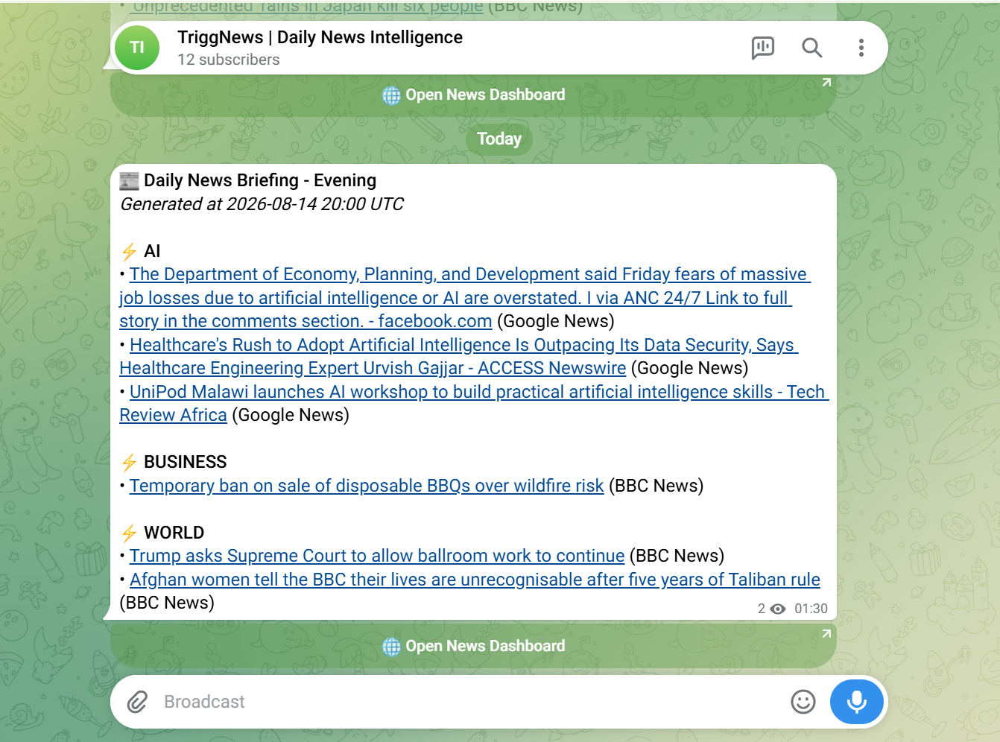

# TriggNews - Daily Trending News Telegram Bot

[](LICENSE)
[](https://github.com/NarendraReddy077/trending-news-telegram-bot)


A serverless AWS-native solution that fetches news from RSS feeds and external APIs, calculates a trending score for each article, automatically broadcasts high-scoring news to a Telegram channel, and serves a modern frontend dashboard.

🔗 **Live Telegram channel:** [t.me/FindMyNewsChannel](https://t.me/FindMyNewsChannel)
🔗 **Live dashboard:** [News Dashboard (S3-hosted)](http://telegramnewsbotstack-frontendbucketefe2e19c-yxqiq5eyfhlf.s3-website.ap-south-1.amazonaws.com/)

## 📋 Table of Contents
- [Features](#-features)
- [Architecture](#-architecture)
- [Screenshots](#-screenshots)
- [Project Structure](#-project-structure)
- [Prerequisites](#-prerequisites)
- [Installation](#-installation)
- [Usage](#-usage)
- [Running Tests](#-running-tests)
- [Contributing](#-contributing)
- [License](#-license)
- [Contact](#-contact)

## ✨ Features
- **Automated Dual-Daily News Collection**: Scheduled runs via EventBridge cron rules (8:00 AM/PM UTC).
- **Popularity Scoring & Deduplication**: Intelligent scoring algorithm with DynamoDB URL hashing to filter duplicates.
- **AWS Secrets Manager Integration**: Securely loads Telegram Bot tokens, chat IDs, and external API keys.
- **FastAPI-powered REST API**: Serve queries, categories, and force-triggered crawls on-demand using Mangum on AWS Lambda.
- **Built-in Responsive Web Dashboard**: Clean static dashboard (HTML, CSS, JS) with dark mode UI, category filtering, search, and manual crawl invocation.
- **Flexible Infrastructure Options**: Easy deployment using Python AWS CDK with an option to bypass CloudFront for local staging or faster feedback loops.

## 🏗 Architecture



**Scheduled news delivery:** EventBridge triggers the Fetcher Lambda twice daily → it pulls from RSS feeds/News APIs, fetches credentials from Secrets Manager, scores and deduplicates articles into DynamoDB → formatted briefings are pushed to Telegram users.

**On-demand dashboard:** Telegram users tap the inline dashboard link → CloudFront routes static assets from S3 and API calls (`GET /api/*`) to the FastAPI Lambda → the API queries the same DynamoDB table for the latest news. All Lambda activity is monitored via CloudWatch Logs.

**CI/CD:** A push to `main` triggers GitHub Actions to test, build, and run `cdk deploy`, which provisions the Lambdas, EventBridge rules, and S3 + CloudFront resources.

## 📸 Screenshots

**Telegram daily briefing:**



**Web dashboard:**


## 📁 Project Structure
```text
.
├── backend/
│   ├── api/            # FastAPI REST API backend (Lambda function)
│   └── fetcher/        # RSS feed parser and Telegram broadcast logic (Lambda function)
├── frontend/           # Static web dashboard (HTML, CSS, JS) hosted on S3/CloudFront
├── telegram_news_bot/  # AWS CDK Infrastructure Stack definition
├── tests/              # Automated unit testing suites using pytest
├── docs/                # Architecture diagram and screenshots
├── app.py              # CDK app entrypoint
├── source.bat          # Windows virtual environment activation helper
└── README.md           # Root landing page documentation
```

## ⚙️ Prerequisites
Before starting, ensure you have installed:
- Python (v3.11)
- Node.js (v18.0.0 or higher)
- npm (v9.0.0 or higher)
- AWS CLI configured with active credentials

## 🚀 Installation
Follow these sequential steps to set up the development environment locally:

1. Clone the repository:
   ```bash
   git clone https://github.com/NarendraReddy077/trending-news-telegram-bot.git
   ```
2. Navigate to the project directory:
   ```bash
   cd trending-news-telegram-bot
   ```
3. Set up the Python virtual environment:
   - **On Windows**:
     ```powershell
     python -m venv .venv
     .venv\Scripts\activate
     ```
   - **On macOS/Linux**:
     ```bash
     python3 -m venv .venv
     source .venv/bin/activate
     ```
4. Install python dependencies:
   ```bash
   pip install -r requirements.txt
   pip install -r requirements-dev.txt
   ```
5. Install AWS CDK CLI globally:
   ```bash
   npm install -g aws-cdk
   ```

## 💡 Usage

### 1. Configure Credentials
The bot relies on a secret named `TelegramNewsBotSecrets` in AWS Secrets Manager. Create it using the AWS CLI:
```bash
aws secretsmanager create-secret --name TelegramNewsBotSecrets \
    --description "Credentials for Telegram News Bot" \
    --secret-string '{"TELEGRAM_BOT_TOKEN":"YOUR_TELEGRAM_BOT_TOKEN","TELEGRAM_CHAT_ID":"YOUR_TELEGRAM_CHAT_ID","NEWS_API_KEY":"YOUR_OPTIONAL_NEWS_API_KEY"}'
```

### 2. Deploy Infrastructure
To build the lambdas and deploy the stack:
```bash
# Bootstrap CDK (First time only)
cdk bootstrap

# Deploy stack
cdk deploy
```

For faster iteration cycles, deploy with CloudFront disabled to host directly via public S3:
```bash
cdk deploy --context disable_cloudfront=true
```

## 🧪 Running Tests
Run the test suite to verify the Lambda handlers, scoring logic, and API routes:

```bash
# Run unit tests
pytest
```

## 🤝 Contributing
Contributions make the open-source community an amazing place to learn, inspire, and create.
1. Fork the Project
2. Create your Feature Branch (`git checkout -b feature/AmazingFeature`)
3. Commit your Changes (`git commit -m 'Add some AmazingFeature'`)
4. Push to the Branch (`git push origin feature/AmazingFeature`)
5. Open a Pull Request

## 📄 License
Distributed under the MIT License. See the [LICENSE](LICENSE) file for details.

## ✉️ Contact
**Narendra Reddy Molakala**
- 📧 Email: [narendra9737406@gmail.com](mailto:narendra9737406@gmail.com)
- 💼 LinkedIn: [linkedin.com/in/narendra-reddy-molakala-1b220a207](https://www.linkedin.com/in/narendra-reddy-molakala-1b220a207)
- 🐙 GitHub: [@NarendraReddy077](https://github.com/NarendraReddy077)

Project Link: [https://github.com/NarendraReddy077/trending-news-telegram-bot](https://github.com/NarendraReddy077/trending-news-telegram-bot)
